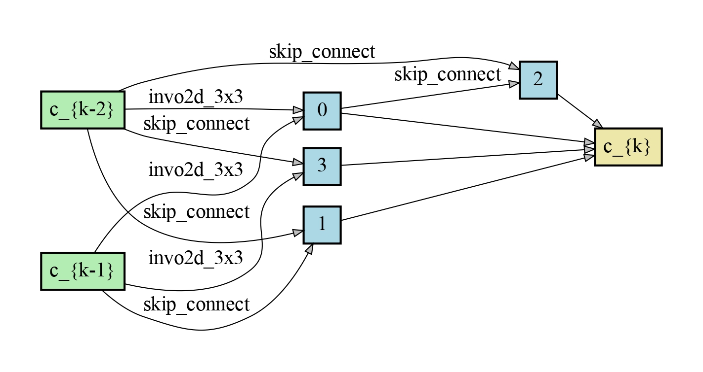
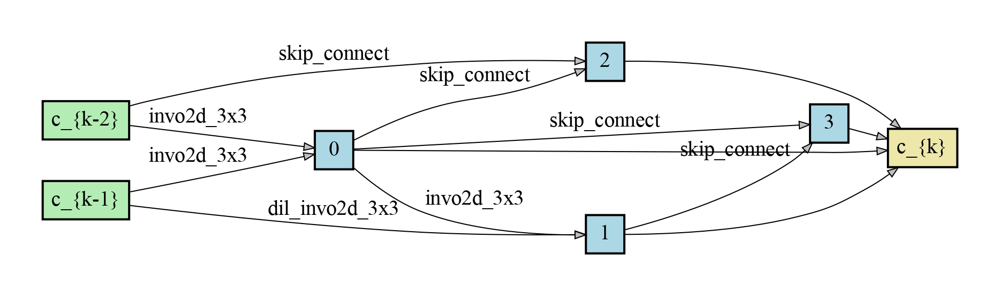
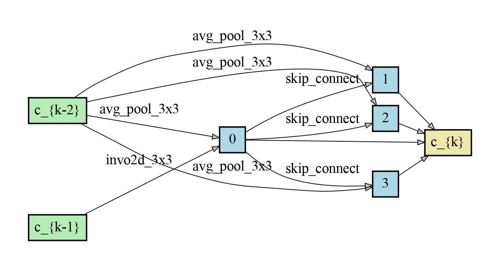
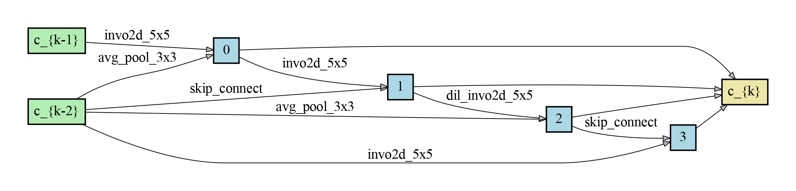
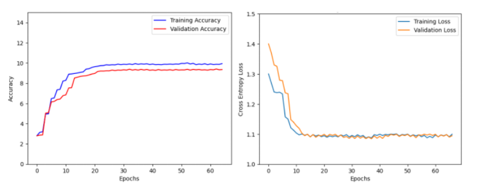
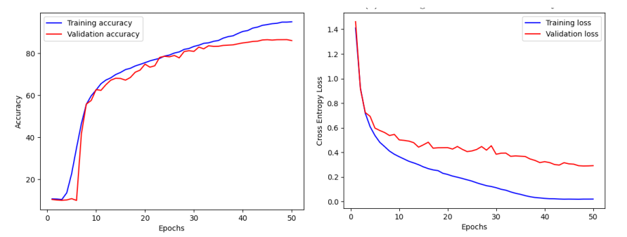
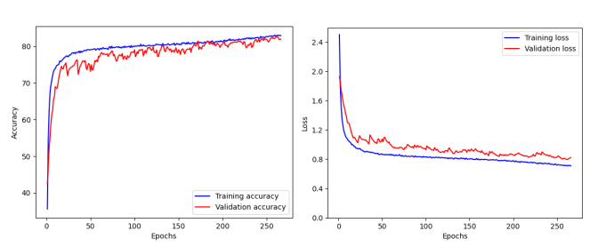
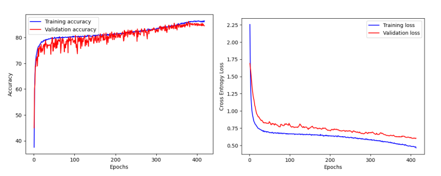
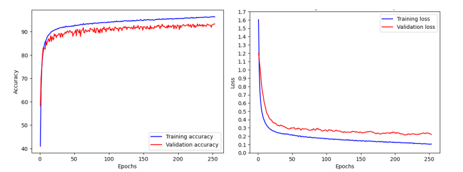

# Image-classification-using-DARTS-with-Involution
# Requriments
    python >=3.6, pytorch==1.5.0 torchvision==0.6.0
# New search space for DARTS

- involution 3x3
- involution 5x5
- involution 7x7
- dilated involution 3x3
- dilated involution 5x5
- max pooling
- average pooling
- zero operation
- identity
- no operation

# Datasets
  We used CIFAR-10 which can be automatically downloaded by torchvision.
# Architecture search with involution
    python train_search.py --unrolled   #for involutional cells on CIFAR-10

Sample searched architecture at diffrent epochs

  <table>
    <tr>
      <td style="text-align:center">
        
         
        <em>Normal cell at epoch 36</em>
      </td>
      <td style="text-align:center">
        
         
        <em>Normal cell at epoch 46</em>
      </td>
    </tr>
  </table>

  <table>
    <tr>
      <td style="text-align:center">
        
         
        <em>Reduction cell at epoch 36</em>
      </td>
      <td style="text-align:center">
        
         
        <em>Reduction cell at epoch 46</em>
      </td>
    </tr>
  </table>

# Architecture evaluation 
        python3 train.py --gpu 0 --batch_size 32 --learning_rate 0.05 --cutout --auxiliary --layer 4 --arch                 "Genotype(normal=[('sep_invo_3x3', 1), ('sep_invo_3x3', 0), ('sep_invo_3x3', 2), ('dil_invo_3x3', 1),
        ('skip_connect', 0), ('skip_connect', 2), ('skip_connect', 2), ('skip_connect', 3)], 
        normal_concat=range(2,6), reduce=[('avg_pool_3x3', 0), ('sep_invo_5x5', 1), ('sep_invo_5x5', 2),                   ('skip_connect', 0),('avg_pool_3x3', 0), ('dil_invo_5x5', 3), ('skip_connect', 4), ('sep_invo_5x5', 0)],            reduce_concat=range(2,6))"

# Experiments and results
The search for architecture comprised of 20 cells, however the initial search outcomes were inadequate with merely 10% loss value. It was inferred that this lacklustre performance could be attributed to the expansive search space or the excessive number of layers, which caused the image size to become too small for the model to effectively
learn, thereby hindering the search for an optimal architecture. 
 

  
  
<em>a) Training and validation accuracy b) Training and validation loss</em>

We modified the number of layers in the model to 8, resulting in a significant increase in accuracy for architecture search. This modification led to a training accuracy of 92.21% in one of the architecture search experiments. 

  
  
<em>a) Training and validation accuracy b) Training and validation loss</em>

- Different cell architectures with different hyperparameters
  - Layers=8
        - batch_size=32, layers=8, learning_rate=0.05, cutout=True, cutout_length=16

  
  
<em>a) Training and validation accuracy b) Training and validation loss</em>

        'Genotype(normal=[('dil_conv_3x3', 0), ('skip_connect', 1), ('skip_connect', 0), ('skip_connect', 2), 
        ('sep_conv_3x3', 2), ('dil_conv_5x5', 0), ('skip_connect', 0), ('skip_connect', 2)], normal_concat=range(2, 
        6),  reduce=[('sep_conv_3x3', 0), ('sep_conv_5x5', 1), ('avg_pool_3x3', 1), ('skip_connect', 2), 
        ('skip_connect', 2), ('skip_connect', 3), ('dil_conv_3x3', 3), ('skip_connect', 1)], reduce_concat=range(2, 
        6))'
        
- Results

| Training accuracy | Validation accuracy |
|----------|----------|
| 83.72% | 82.07% |

- Layers=10
      - batch_size=32, layers=10, learning_rate=0.025, cutout=True, cutout_length=16

  

  
  
<em>a) Training and validation accuracy b) Training and validation loss</em>

        Genotype(normal=[(‘invo2d_3x3’, 1), (‘invo2d_3x3’, 0), (‘invo2d_3x3’, 2),
        (‘dil_invo2d_3x3’, 1), (‘skip_conn’, 0), (‘skip_conn’, 2), (‘skip_conn’, 2),
        (‘skip_conn’, 3)], normal_concat=range(2, 6),
        reduce=[(‘avg_pool_3x3’, 0), (‘invo2d_5x5’, 1), (‘invo2d_5x5’, 2),
        (‘skip_conn’, 0), (‘avg_pool_3x3’, 0), (‘dil_invo2d_5x5’, 3),
        (‘skip_conn’, 4), (‘invo2d_5x5’, 0)], reduce_concat=range(2, 6))
        
- Results

| Training accuracy | Validation accuracy |
|----------|----------|
| 90.94% | 83.23% |

- Layers=20
      - batch_size=32, cutout=False, layers=20, learning_rate=0.01

  
  
<em>a) Training and validation accuracy b) Training and validation loss</em>

        "Genotype(normal=[(‘invo2d_3x3’, 0), (‘invo2d_3x3’, 1),
        (‘skip_conn’, 0), (‘skip_conn’, 1), (‘skip_conn’, 0),
        (‘skip_conn’, 2), (‘skip_conn’, 0), (‘invo2d_3x3’, 1)],
        normal_concat=range(2, 6),
        reduce=[(‘avg_pool_3x3’, 0), (‘invo2d_3x3’, 1),
        (‘skip_conn’, 2), (‘avg_pool_3x3’, 0), (‘skip_conn’, 2),
        (‘avg_pool_3x3’, 0), (‘avg_pool_3x3’, 0), (‘skip_conn’, 2)],
        reduce_concat=range(2, 6))"

- Results

| Training accuracy | Validation accuracy |
|----------|----------|
| 96.41% | 93.17% |

# Visualization 
        python visualize.py DARTS

where DARTS can be replaced by any customised architecture in genotypes.py.

  

